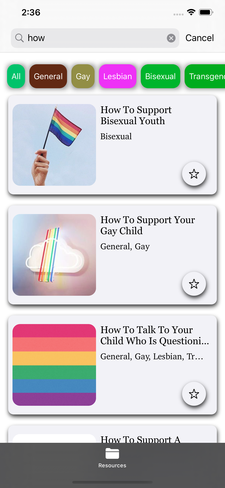
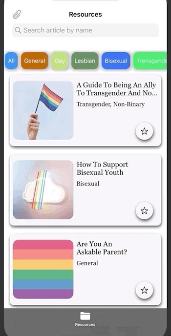
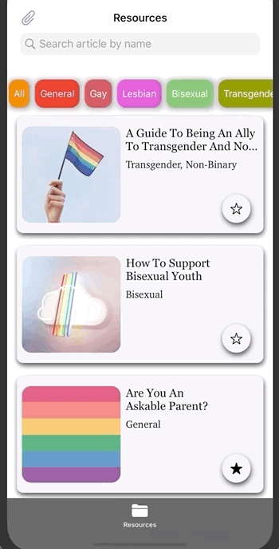

# QParenting

QParenting is an iOS app that hopes to provide parents/guardians with knowledge and tools on how to support or better support their LGBTQ children. Parents will have access to articles pertaining to sexuality/gender as well as general information on supporting your child after they've come out. 


## Features

Users are able to find specific articles by using tags


Users are also able to search for articles by titles



Users can read articles and save articles to a collection



Users can unsave articles from their saved articles collection



## Code Snippets

Search function that works based off either text or a tag.

```
    func search(searchText text: String?,searchTag tag: String?) {
        var articles = [SiteInfo]()
        
        
        if let searchText = text {
            guard !searchText.isEmpty else { return }
            articles = resources.filter { $0.name.lowercased().contains(searchText)}
        } else if let tag = tag {
            if tag == "All" { articles = fetchResources() }
            else {
                articles = Array(Set(resources.filter { $0.tags.contains(tag) }))
            }
        } else {
            articles = fetchResources()
        }
```

## Technologies 

This project uses a custom JSON API:
https://github.com/maitreebain/QParenting/blob/master/QParenting/QParenting/Resource%20Files/Links.json

This project uses a DataPersistence dependency to save user data to their local device. This project uses DiffableDataSource to create customized UICollectionViews, and uses UISearchControllers to produce a consistent and smooth UI. 

DataPersistence dependency:
https://github.com/alexpaul/DataPersistence


